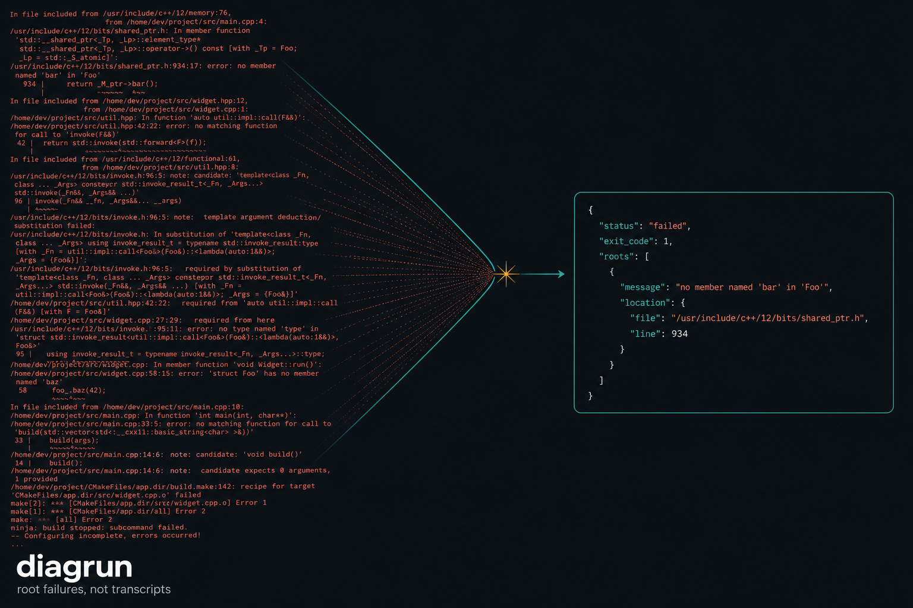
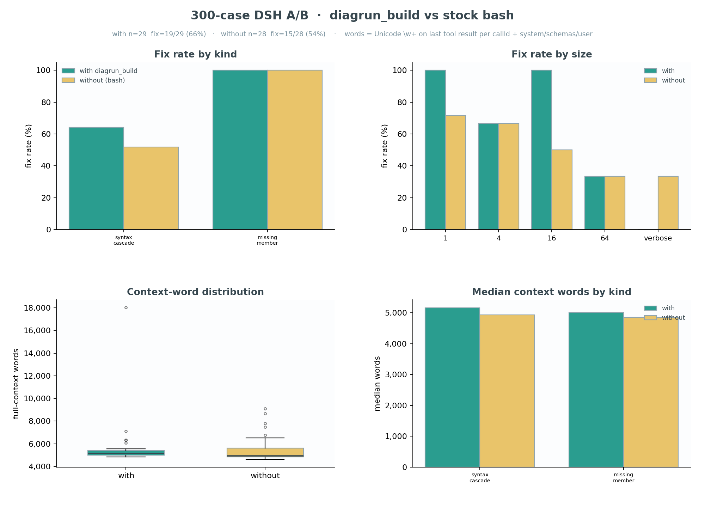
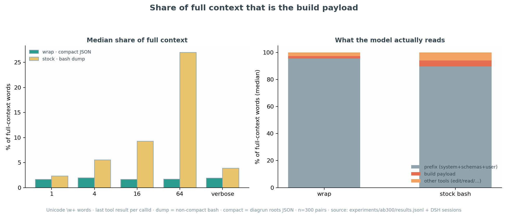

# diagrun

**Root failures, not transcripts.**

Coding agents should not read a 50 KB `cmake --build` dump to fix one missing member. diagrun runs the compile, parks the full log on disk, and hands the model the independent roots: file, line, message, kind.



It is a **deterministic diagnostic compiler**, not a summarizer and not a repair bot. No LLM in the loop. No extra tool schemas on DeepSeek Harness — `bash make` comes back as compact JSON.

## Why agents stall on C++ builds

A failed rebuild is mostly cascade: parse-recovery notes, duplicate TUs, Make `Error 1`. Stock harness bounding still leaves a fat dump in context. The model then rebuilds, gets the same wall of text, and loops.

diagrun collapses that wall to the faults you can actually patch.

| | Stock `bash make` | diagrun wrap |
|--|--|--|
| What the model sees | Compiler dump (spill/pruner still apply) | Compact `roots[]` JSON |
| Size-64 dump share of the prompt | **28%** | **~2%** |
| Build-payload words | baseline | **91% smaller** |
| Median build-word savings (300 pairs) | — | **69%** |

300 generated C++ apps × 2 arms, DeepSeek Harness, qwen3-8b. Words = Unicode `\w+`. Prefix (system + schemas + user) still dominates both arms — the win is **on the dump**, where it belongs. See [docs/ab300-build-savings.png](docs/ab300-build-savings.png).

## How it works

```text
agent  →  bash: make   or   diagrun_build
              ↓
         diagrun captures stdout/stderr, stores a ULID run
              ↓
         compact JSON: status, exit_code, run_id, roots[], raw.ref
```

- **Humans:** `diagrun -- make` streams live, same exit code, log stored.
- **DeepSeek Harness:** intercepts pure `make` / `ninja` / `cmake --build` / `g++`. Combinators and `make test` pass through.
- **MCP / Pi:** named `diagrun_*` tools over the same Python ops.

Unknowns stay visible. Prefer a noisy follow-on over hiding a real fault. The coding agent still reads source and writes the patch.

## Quick start

Python 3.9+. `g++` + `make` for fixtures. No third-party Python packages.

```bash
export PYTHONPATH="$PWD/src"
python3 -m diagrun -- make -C fixtures/cpp_failures/missing_member
echo $?                          # 2
python3 -m diagrun show --last
```

Agent path:

```bash
python3 -m diagrun call build <<'EOF'
{"command":"make","cwd":"fixtures/cpp_failures/missing_member"}
EOF
```

```json
{"status":"failed","exit_code":2,"run_id":"01JXYZ...","roots":[{"kind":"missing_member","message":"‘struct Widget’ has no member named ‘foo’","location":{"file":"src/main.cpp","line":5}}]}
```

## CLI

```text
usage: diagrun [options] [--] COMMAND [ARGS...]
       diagrun [options] show [--raw] RUN_ID
       diagrun [options] show [--raw] --last
       diagrun mcp
       diagrun call OP
```

| Flag | Default |
|------|---------|
| `--store DIR` | `$DIAGRUN_STORE` or `$XDG_DATA_HOME/diagrun` or `~/.local/share/diagrun` |
| `--max-runs N` | `DIAGRUN_MAX_RUNS` (100) |
| `--max-bytes N` | `DIAGRUN_MAX_BYTES` (512 MiB) |
| `--inject-diagnostics` | on — GCC/Clang diagnostic flags, no codegen change |
| `--collapse-parse-recovery` | **off** on the CLI; **on** for agent builds |

```bash
pip install -e .
# or
export PYTHONPATH="$PWD/src"
```

## Agent surfaces

| Surface | How the model builds |
|---------|----------------------|
| DeepSeek Harness | Stock `bash`. Plugin wraps compile/link; compact JSON is the bash result. |
| MCP / Pi | Named tools below. |

| Tool | Role |
|------|------|
| `diagrun_build` | `make` / `ninja` / `cmake --build` / `g++` → compact JSON |
| `diagrun_get_raw` | Byte slice of the stored log. Only if `roots` and `unclassified` are empty |
| `diagrun_show` | Stored run metadata |
| `diagrun_get_diagnostic` | One parsed diagnostic |

```bash
# MCP
PYTHONPATH=src python3 -m diagrun mcp

# Pi
pi -e ./plugins/diagrun/dev.pi.agent/index.ts

# DeepSeek Harness
dsh plugin --profile headless add ./integrations/dsh-diagrun
```

On hosts without bubblewrap/Landlock, set `DSH_PERMISSION_MODE=danger-full-access`.

## Proof





## Store

```text
<store>/runs/<ULID>/
  meta.json  stdout.bin  stderr.bin  events.jsonl  diagnostics.json
<store>/last
```

## Tests

```bash
PYTHONPATH=src python3 -m unittest discover -s tests -v
```

Fixtures in `fixtures/cpp_failures/` define expected roots. The reducer is tested against those, not against model judgment.

## Docs

| Doc | Topic |
|-----|--------|
| [Architecture](docs/architecture.md) | Pipeline, store, how the model reaches diagrun |
| [Principles](docs/principles.md) | Keep unknowns; collapse cascades; no silent drops |
| [Demo](docs/demo.md) | CLI / Pi / DSH walkthrough |
| [300-case A/B](docs/ab300-build-savings.png) | Build-word savings, prefix excluded |
| [plan.md](plan.md) | Product plan |
