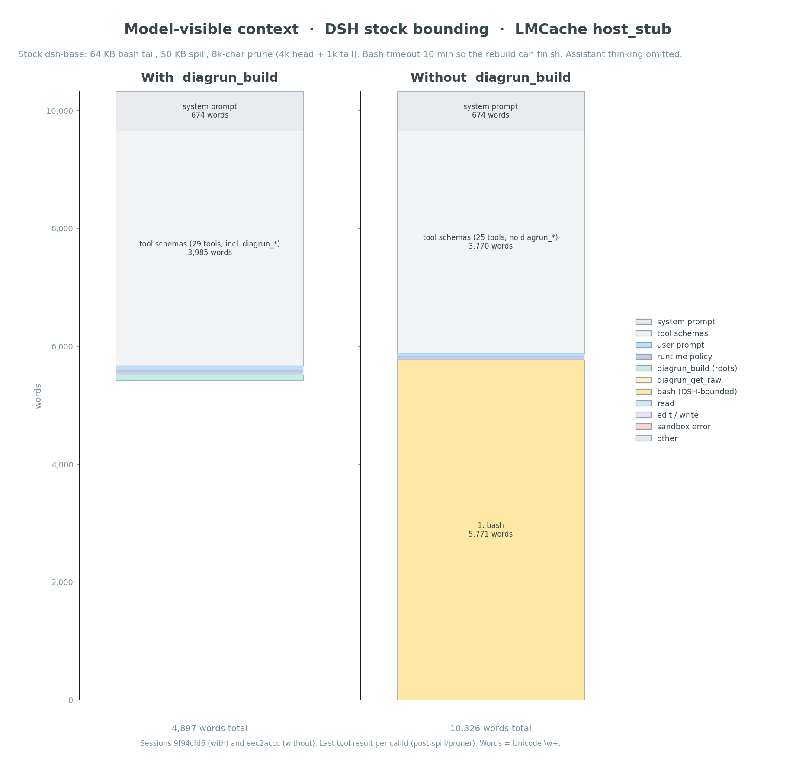

# diagrun

Local CLI and agent tool that wraps C++ builds, stores the full compiler log,
and returns **independent root failures** instead of the raw dump.

Python 3.9+. GCC/Clang + Make/CMake/Ninja. Version `0.1.0`.

It is **not** an HTTP proxy and not an LLM summarizer. The CLI does not
monkey-patch the user's shell. The DeepSeek Harness plugin intercepts
pure `bash` compile/link calls and returns compact JSON through the existing
`bash` tool (no extra schemas). MCP and Pi still expose named `diagrun_*`
tools.

```text
agent
  ↓  bash: make          (DSH wrap)    or    diagrun_build (MCP / Pi)
diagrun  ──make / ninja / g++──►  store (~/.local/share/diagrun/runs/<ULID>/)
  ↓
compact JSON: status, exit_code, run_id, roots[], raw.ref
```

## Why

A failed `cmake --build` can dump tens of kilobytes of cascades, duplicates,
and Make noise into the model context. diagrun keeps the transcript on disk
and returns the faults the agent should act on.



On a tiny fixture the envelope can still be comparable to `bash make`. The
win is **roots in-band** (no `get_raw`) and a smaller payload than the log
when the dump is large (`raw.bytes >= 512`). Call `diagrun_get_raw` only when
both `roots` and `unclassified` are empty.

## Requirements

- Python 3.9+
- `g++` and `make` to run the fixture tests
- Optional: CMake, Ninja, Clang
- Optional: Node 22+ for the Pi / DeepSeek Harness plugins

No third-party Python packages. Install editable or set `PYTHONPATH`:

```bash
cd /path/to/this/repo
export PYTHONPATH="$PWD/src"
python3 -m diagrun --help
# or
pip install -e .
```

## CLI

Humans get a transparent wrapper: live stdout/stderr, original exit code,
plus a stored run.

```bash
python3 -m diagrun -- make -C fixtures/cpp_failures/missing_member
echo $?                          # 2
python3 -m diagrun show --last
python3 -m diagrun show --last --raw | head
```

```text
usage: diagrun [options] [--] COMMAND [ARGS...]
       diagrun [options] show [--raw] RUN_ID
       diagrun [options] show [--raw] --last
       diagrun mcp
       diagrun call OP
```

| Flag | Default |
|------|---------|
| `--store DIR` | `$DIAGRUN_STORE` or `$XDG_DATA_HOME/diagrun` or `~/.local/share/diagrun` |
| `--max-runs N` | `DIAGRUN_MAX_RUNS` (100) |
| `--max-bytes N` | `DIAGRUN_MAX_BYTES` (512 MiB) |
| `--inject-diagnostics` | on — add `-fdiagnostics-format=json` / `-fdiagnostics-color=never` without changing codegen |
| `--collapse-parse-recovery` | **off** on the CLI (keep uncertain follow-on errors) |

Injection wraps `CC`/`CXX` for Make, uses `CMAKE_*_COMPILER_LAUNCHER` on
configure, and PATH shims / `CCC_OVERRIDE_OPTIONS` for `--build` / Ninja.

## Agent JSON

What plugins spawn:

```bash
python3 -m diagrun call build <<'EOF'
{"command":"make","cwd":"fixtures/cpp_failures/missing_member"}
EOF
```

Typical failure (pretty-printed here; the wire format is compact, no indent):

```json
{
  "status": "failed",
  "command": "make",
  "exit_code": 2,
  "run_id": "01JXYZ...",
  "roots": [
    {
      "id": "D1",
      "severity": "error",
      "kind": "missing_member",
      "message": "‘struct Widget’ has no member named ‘foo’",
      "location": {"file": "src/main.cpp", "line": 5, "column": 14}
    }
  ],
  "suppressed": {
    "cascaded_diagnostics": 0,
    "build_system_messages": 1
  },
  "raw": {
    "ref": "diag://run/01JXYZ.../raw",
    "bytes": 457
  }
}
```

| Field | Meaning |
|-------|---------|
| `roots` | Independent faults to fix |
| `unclassified` | Present only if the reducer cannot prove a consequence — keep it |
| `suppressed` | Cascades / build-system lines hidden from the agent |
| `raw.ref` | Pointer to the full log in the store |
| `no_progress` | Same roots as the last `diagrun_build` in this `cwd` — stop rebuilding, inspect the diff |
| `hint` | Only when there are no roots/unclassified, or when `no_progress` is set |

Agent `diagrun_build` defaults **`collapse_parse_recovery` to on** so a
syntax-recovery cascade after a bad edit is not listed as extra roots.

## Tools

| Surface | How the model builds |
|---------|----------------------|
| DeepSeek Harness | Stock `bash` (`make` / `ninja` / `cmake --build` / `g++`). Plugin wraps those calls; compact JSON comes back as the bash result. |
| MCP / Pi | Named tools below. |

| Tool | Role |
|------|------|
| `diagrun_build` | Run `make` / `ninja` / `cmake --build` / `g++`. Returns compact JSON. |
| `diagrun_get_raw` | Byte slice of the stored log. Only if `roots` and `unclassified` are empty. |
| `diagrun_show` | Stored run metadata. |
| `diagrun_get_diagnostic` | One parsed diagnostic from `diagnostics.json`. |

Shared implementation: `diagrun.integrations.api.dispatch(op, params)`.

```text
diagrun call     MCP stdio      DSH plugin       Pi extension
JSON stdin       tools/call     tools/execute    registerTool
        └──────────────┴──────────────┴──────────────┘
                         integrations/api.py
```

### MCP

```bash
PYTHONPATH=src python3 -m diagrun mcp
```

Or Agent Plugins: `plugins/diagrun/` (`mcp.json` → `./bin/diagrun-mcp`).

### Pi

```bash
pi -e ./plugins/diagrun/dev.pi.agent/index.ts
```

This repo also auto-loads `.pi/extensions/diagrun.ts` when present. vLLM
needs `--enable-auto-tool-choice --tool-call-parser hermes` (the `qwen3_xml`
parser left tool calls as text).

### DeepSeek Harness

```bash
dsh plugin --profile headless add ./integrations/dsh-diagrun
```

If `@deepseek-ai/dsh-tools` is unresolved, symlink it under
`integrations/dsh-diagrun/node_modules/@deepseek-ai/dsh-tools`.

The plugin does **not** register extra tools. It wraps `tools/execute` for
pure compile/link `bash` calls. Combinators and `make test`/`clean` pass
through.

On hosts without bubblewrap/Landlock, bash `make` is refused unless
`DSH_PERMISSION_MODE=danger-full-access`.

## Store

```text
<store>/runs/<ULID>/
  meta.json
  stdout.bin
  stderr.bin
  events.jsonl          arrival order; stdout ≠ stderr (pipes, not a PTY)
  wrappers/             inject shims, when used
  diagnostics.json      after parsers run
<store>/last
```

| Env | Default |
|-----|---------|
| `DIAGRUN_STORE` | XDG / `~/.local/share/diagrun` |
| `DIAGRUN_MAX_RUNS` | 100 |
| `DIAGRUN_MAX_BYTES` | 512 MiB |
| `DIAGRUN_INJECT_DIAGNOSTICS` | `1` |
| `DIAGRUN_COLLAPSE_PARSE_RECOVERY` | `0` CLI; `1` for `diagrun_build` |

## Tests and fixtures

```bash
PYTHONPATH=src python3 -m unittest discover -s tests -v
```

Corpora under `fixtures/cpp_failures/` (each has a `Makefile` and
`expected/` roots):

| Fixture | What it covers |
|---------|----------------|
| `missing_member` | `Widget` has no `foo` |
| `missing_include` | missing header |
| `wrong_function_signature` | call/definition mismatch |
| `syntax_cascade` | parse-recovery follow-ons |
| `template_instantiation` | template notes vs root |
| `concept_failure` | C++20 concepts |
| `shared_header_many_tus` | same header error in many TUs |
| `multiple_independent_errors` | more than one root |
| `linker_undefined_symbol` | collect2 / undefined ref |
| `make_propagation` | Make `Error 1` as build consequence |

The reducer is tested against these expected roots, not against model
judgment.

## Layout

```text
src/diagrun/              capture, store, parsers, reducer, CLI, MCP
integrations/dsh-diagrun/ DeepSeek Harness plugin
plugins/diagrun/          Pi extension + Agent Plugins MCP package
fixtures/cpp_failures/    failing GCC/Make corpora
tests/                    unittest
docs/                     architecture, principles, demos
plan.md                   product plan (open: real-repo corpus, over/under-reduction log)
```

**Implemented:** capture, store, diagnostic-flag injection, GCC/Clang
parsers, Make/Ninja suppression, fingerprint grouping, compact agent JSON,
MCP / DSH / Pi adapters.

**Not a repair agent.** diagrun does not generate patches. The coding agent
still reads source and applies the fix. Prefer a false negative on collapse
(leave a noisy follow-on) over hiding a real fault.

## Docs

| Doc | Topic |
|-----|--------|
| [docs/architecture.md](docs/architecture.md) | Pipeline, store, how the model reaches diagrun |
| [docs/principles.md](docs/principles.md) | Keep unknowns; collapse cascades; no silent drops |
| [docs/demo.md](docs/demo.md) | CLI / Pi / DSH walkthrough |
| [docs/dsh-headless-example.md](docs/dsh-headless-example.md) | A/B: wrap on vs `bash make` |
| [docs/ab300-fix-and-context.png](docs/ab300-fix-and-context.png) | 300-case fix rate and full-context words |
| [docs/ab300-build-dump-share.png](docs/ab300-build-dump-share.png) | Share of prompt that is the compiler dump |
| [docs/ab300-build-savings.png](docs/ab300-build-savings.png) | Savings on build words only (prefix excluded) |
| [docs/ab300-first-payload.png](docs/ab300-first-payload.png) | First compile: compact JSON vs bash dump |
| [plan.md](plan.md) | Full build plan |
