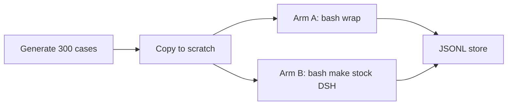

# 300-case DSH A/B (with vs without diagrun)

Full agent-fix loops on **generated** trees only (no LMCache). 300 cases × 2 arms = 600 DSH sessions, resumable. Stock DSH output bounding stays on for the no-tool arm (64 KB tail, 50 KB spill, 8k pruner). Only non-default: 10 min bash timeout so larger compiles can finish.

## Case grid (~300)

Programmatic generator, not hand-written fixtures. Factor:

- **10 fault kinds** (aligned with [`DiagnosticKind`](src/diagrun/diagnostics/model.py) + existing [`fixtures/cpp_failures/`](fixtures/cpp_failures/)): `syntax_cascade`, `missing_member`, `undeclared_identifier`, `wrong_function_signature`, `missing_include`, `redeclaration`, `template_instantiation`, `concept_failure`, `linker_undefined_symbol`, `shared_header_fanout`
- **5 sizes:** 1 / 4 / 16 / 64 TUs, plus **verbose** (1–4 TUs with ~50–150 KB of dummy generated C++ so dumps are large)
- **6 variants:** inject in `.cpp` vs header; error near start vs end of the TU; seed 0/1 (slightly different dummy names)

10 × 5 × 6 = **300**. Each case gets a `fixture.json`: `id`, `kind`, `size_class`, `n_tus`, `source_bytes`, `propagation`, `gold_return_code`, `inject` (file + old/new).

Generator writes under [`experiments/ab300/cases/<id>/`](experiments/ab300/cases/) from a vanilla template (Makefile + `include/app.hpp` + `src/main.cpp` + `src/tu_NNNN.cpp` of padding). **Vanilla is the uninjected tree**; the case directory on disk is vanilla + one injection. Gold check: `make && ./app` exits with `gold_return_code` (same as vanilla). That blocks “fix” by deleting `main`.

Propagation mapping:

- `syntax_cascade` — broken initializer + follow-on member access (like current fixture)
- `shared_header_fanout` — fault in shared header, N TUs include it
- `linker_undefined_symbol` — compile OK, link fails
- others — single-root semantic/type/include/template/concept

## A/B protocol (always both arms)

For each case, **copy** the case tree to two scratch dirs (`/tmp/ab300/<id>/with`, `/tmp/ab300/<id>/without`). Never edit the generator output in place.

- **Arm A (wrap):** `dsh-diagrun` plugin on. Same user prompt as arm B: `bash` `make` in scratch. Plugin intercepts pure compile/link and returns compact roots as the bash result. Stop when `exit_code` is 0 and `./app` still matches gold.
- **Arm B (no-tool):** plugin off (`headless-no-diagrun`). Same prompt. Stock spill/pruner; `bash-sandbox.timeoutMs: 600000` only.

`DSH_PERMISSION_MODE=danger-full-access` so edits inside scratch work. Sequential sessions against the one vLLM (`qwen3-8b`, 32k) — expect **~20–50 hours**; the runner **must checkpoint**.

## What to store (one row per arm)

Append-only [`experiments/ab300/results.jsonl`](experiments/ab300/results.jsonl) (and a small SQLite optional later). Fields:

- `case_id`, `arm` (`with`|`without`), `kind`, `size_class`, `n_tus`
- `session_id`, `elapsed_s`, `dsh_exit`
- `fixed` (`make` exit 0 **and** `./app` gold)
- `n_diagrun_build`, `n_bash`, `n_edit`, `n_read`
- **Context:** `tool_result_bytes_total`, `tool_result_words_total`, `first_tool_result_bytes`, `last_tool_result_bytes`, `full_context_words` (system+schemas+user+last-per-callId results — reuse logic from [`docs/plot_context_ab.py`](docs/plot_context_ab.py))
- Arm A extras: `first_compact_status`, `first_raw_bytes`, `first_root_kinds`
- Arm B extras: spill/prune markers if present
- `error` if harness crashed

Checkpoint: skip `(case_id, arm)` already in jsonl. Crash-safe: write the line only after gold check. Log DSH stdout tails under `experiments/ab300/logs/<id>-<arm>.txt`.

## Runner layout (new files)

- [`experiments/ab300/generate_cases.py`](experiments/ab300/generate_cases.py) — emit 300 trees + index
- [`experiments/ab300/run_ab.py`](experiments/ab300/run_ab.py) — loop cases × arms, DSH, measure, jsonl
- [`experiments/ab300/measure_session.py`](experiments/ab300/measure_session.py) — zstd jsonl → context stats (shared with plot)
- [`experiments/ab300/plot_ab300.py`](experiments/ab300/plot_ab300.py) → **new** image [`docs/ab300-fix-and-context.png`](docs/ab300-fix-and-context.png) (do not overwrite `context-with-vs-without.png`): fix rate A vs B by kind and by size; context-word distributions
- Optional: `headless-no-diagrun` profile clone of [`~/.dsh/profiles/headless/`](~/.dsh/profiles/headless/) without the plugin

Smoke: generate all 300, `make` fails as expected, vanilla gold passes, then **2 cases × 2 arms** end-to-end before the long run.

## Scoring notes (from the 4-case trial)

Compact roots already named the fault; two misses were **wrong repair** (add API vs revert injection). Gold `./app` plus “minimal edit” in the prompt reduces gutting. Do not treat a compile-green empty `main` as success.

## Time / ops

- Tiny/small cases: ~1–3 min/arm; verbose/64-TU: compile-bound
- One GPU vLLM: **do not parallelize DSH**
- Keep `csrc/` LMCache untouched; generated trees only

b04 docker.sock is `root:root` (this user cannot start containers here).
This run's vLLM is on **910B3-03** `192.168.0.42:8001` (qwen3-8b, hermes, NPU 0
inside existing `performability-n0`). `~/.dsh/settings.yaml` `baseURL` points there.
